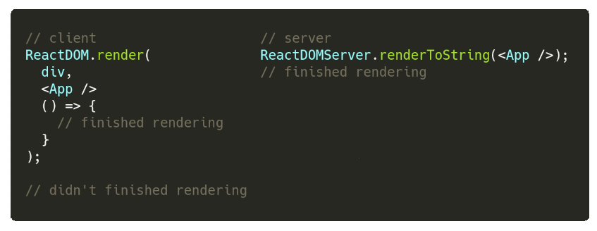
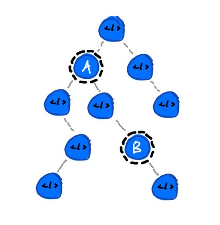

_tl;dr In this post I'll try to show what, in my opnion, are the current pain points on the common ways to do ssr in React, comparing existing solutions in a didactic way._

First of all, what's SSR?. SSR is the acronym for _server side rendering_. On a high level, this means generating the complete web page on the server without having to rely on the client side javascript.

We won't enter on full details of why you'd want to do this, but, it can be mainly motivated by  [SEO concerns](https://www.youtube.com/watch?v=PFwUbgvpdaQ), [accessibility](https://www.svtplay.se/klipp/16183939/reactjs-meetup-svt---english-subtitles?position=173) or just [performance](https://developers.google.com/web/updates/2019/02/rendering-on-the-web).

## Problems behind SSR

If we take a quick look to the [react documentation](https://reactjs.org/docs/react-dom-server.html#rendertostring) server side rendering might be seen as something quite simple. Just import `react-dom/server` and call `renderToString` method. _Easy peasy:_

```js
const http = require('http');
const ReactDOMServer = require('react-dom/server');
const App = require('./App.js');

const server = http.createServer((req, res) => {
  const html = ReactDOMServer.renderToString(
    <App />
  );
  res.send(html);
});

server.listen(8000);
```

Well, sadly this will not work. Mainly because we are used to writing [_jsx_](https://reactjs.org/docs/jsx-in-depth.html) in React, and we tend to forget that it isn't valid javascript. We could change the `<App />`  line to use `React.createElement` but that approach wouldn't escale for all the `App.js` file, the rest of the components and _css_ files (it gets worse if a css pre-processor is used). So, here comes the first problem: _The need of transpiling server code_.


A common practice is dispatching data fetching on the [_componentDidMount_ lifecycle](https://reactjs.org/docs/react-component.html#componentdidmount). But, do we have that life cycle method on server side?, _spoiler_: **_no_**. Really, it won't make any sense having `componentDidMount` on server, remember that `renderToString` is a synchronous single pass rendering, while on client side, we would call `setState` after data fetching is done in order to trigger another rendering phase. This difference between life cycles leds to several problems, first of all, how can we determine and fetch data before we render on server side?. And second, how can we share the state (which would have been generated with `setState`) between server and client?.

Last but not least, on client side we would trigger data fetching with ajax. Something like making a [fetch](https://developer.mozilla.org/docs/Web/API/Fetch_API) call to an endpoint. This request will have specific information (mainly host information and headers such as the _cookie_ one), how can this be replicated on server side?

To round up, we'll have to deal with the following issues:

1. Generating valid JS code for the server
2. Determining data dependencies
3. Actually fetching data
4. Sharing state _(do not forget to prevent double fetch!)_

## Generating valid JS code for the server

React is known for having a steep configuration in order to get it running. If we check what is considered a _hello world_ example (using [_create react app_](https://facebook.github.io/create-react-app/)) we would realize that we are including like [1300 dependencies](https://npm.anvaka.com/#/view/2d/react-scripts) . All these dependencies deal with a lot of features and requirements that we probably don't need, but, you get the point, it isn't something simple to get react running.


As far as how could we get valid node js code, we've got several options:

* **Webpack**: apply similar building steps as it's done with the client code
* **Babel:** transpile the code using [babel-cli](https://babeljs.io/docs/en/babel-cli), no bundling.

There are many more options, we could use another bundlers (or compile with zeit's ncc), but it doesn't make much sense to throw new tooling.

Being pedantic, we should not need webpack, babel could be the one and only tool used for generating valid node js code. In fact, webpack will use babel under the hood for transpiling, so we could skip the intermediary. On the nodejs case, bundling isn't something we need, we can have many files and include them via [node's module system](https://nodejs.org/api/modules.html), ie., in a less fancier way, use `require`.


The problem of _the one tool to rule them all approach (ie. only babel)_ is that generally webpack is doing more tasks that only transpiling. For example, are we using css modules?, so, webpack is doing a name mangling of the classes to renerate unique names via [the css loader](https://github.com/webpack-contrib/css-loader). Are we using build time constants?, we are probably defining them with [webpack's define plugin](https://webpack.js.org/plugins/define-plugin/). There are more examples of tasks that webpack is performing (static files, etc, etc), but for each of these tasks we'll have to find a babel preset or plugin that performs this job.

If we stick with the webpack path, although, we won't have the same configuration file for client and server, both files will be very similar, sharing most of its code. Also, most webpack loaders have a sort of explanation of how to use them for server side rendering (for example, css loader has the [_exportOnlyLocals_ option](https://github.com/webpack-contrib/css-loader#exportonlylocals) ).

Well, returning to our objective, we'll need to add some packages:

* Webpack (and webpack cli)
* Babel (preset and loaders)
* React (and react dom)

```bash
yarn add --dev webpack webpack-cli webpack-node-externals @babel/core @babel/preset-env @babel/preset-react babel-loader
yarn add react react-dom
```

You may be wondering what `webpack-node-externals` is, well, on node, we don't want to bundle packages that can be included (`require`) on runtime (all packages from `node_modules` and the standard library), [webpack-node-externals](https://www.npmjs.com/package/webpack-node-externals) does exactly that.

Instead of separating build phases of server and client will use [webpack's array configuration](https://webpack.js.org/configuration/configuration-types/#exporting-multiple-configurations):

```js
module.exports = [
  // Client configuration
  {
    mode,
    entry: path.join(src, 'client'),
    output: {
      path: dist,
      filename: 'client.js',
    },
    module: {
      rules: [
        {
          test: /\.js$/,
          include: [src],
          use: [
            {
              loader: 'babel-loader',
              options: {
                presets: [
                  ['@babel/preset-env', { modules: false }],
                  '@babel/preset-react'
                ],
              },
            },
          ],
        },
      ],
    },
  },
  // Server configuration
  {
    mode,
    target: 'node',
    entry: src,
    output: {
      path: dist,
      filename: 'server.js',
    },
    module: {
      rules: [
        {
          test: /\.js$/,
          include: [src],
          use: [
            {
              loader: 'babel-loader',
              options: {
                presets: [
                  ['@babel/preset-env', { targets: { node: 'current' }}],
                  '@babel/preset-react'
                ],
              },
            },
          ],
        },
      ],
    },
    externals: [
      nodeExternals(),
    ],
  },
];
```

I won't enter into details about babel presets: [babel-preset-env](https://babeljs.io/docs/en/babel-preset-env) is the easiest way to support new ECMA syntax and [babel-preset-react](https://babeljs.io/docs/en/babel-preset-react) allow us to write jsx.

[Full example can be found here](https://github.com/NickCis/a-pain-in-the-react-challenges-behind-ssr/tree/master/1-webpack-ssr).

So, are we done?. The quick answer is no. This example was the minimum to get React server side rendering running, it lacks of many features (no css, no static files, no source map, no production optimization, no vendor bundle, no code spliting, etc). Although, we could start building a full project from this, it isn't recommended. Now a days, we probably will use a tool that abstract all this configuration, such as [razzle](https://github.com/jaredpalmer/razzle), [next.js](https://github.com/zeit/next.js) or [react-server](https://github.com/redfin/react-server). The idea of the example was to understand, on a higher level, how these tools work under the hood.

_For the following examples we will use razzle to reduce the needed boilerplate._

## Determining data dependencies

As I have said before, React on server behaves differently than on client. When calling [_renderToString_](https://reactjs.org/docs/react-dom-server.html#rendertostring)_,_ we are doing a sync one pass render. This means that in order to generate the complete page we will have to figure out how to fetch all the needed data before rendering.



There are mainly two approaches to solve this problem:

* A Page / Route based approach ([NextJs's getInitialProps ](https://nextjs.org/docs#fetching-data-and-component-lifecycle)or [Afterjs's _getInitialProps_](https://github.com/jaredpalmer/after.js/blob/master/README.md#getinitialprops-ctx--data))
* Component tree based approach ([Apollo's _getDataFromTree_](https://www.apollographql.com/docs/react/features/server-side-rendering#getDataFromTree))

The first one relies heavily on using a router that works inside and outside the react world. Firstly, we would define Pages or Routes, ie, React components that will be rendered when a particular url is fetched. This can be done in many ways, eg, [NextJs's uses a filename convention](https://nextjs.org/docs), or we could just have a routes object where urls are mapped to specific components.

It is important to note that we will only take into account data dependencies of pages (or routes), child components will be ignored. This is also highlighted on [NextJs's doc](https://nextjs.org/docs#fetching-data-and-component-lifecycle):

> _Note:_ `getInitialProps` _can **not** be used in children components. Only in_ `pages`_._

So, the idea will be something like the following:

1. Get the url from the request
2. Determine the pages that will be rendered for that url
3. Call `getInitialProps` (or the data fetching method of the page)

We'll start writing a _routes_ file in order to define what pages are rendered with each urls:

```js
import Home from './Home';
import Other from './Other';

const routes = [
  {
    path: '/',
    component: Home,
    exact: true
  },
  {
    path: '/other',
    component: Other,
    exact: true
  }
];

export default routes;
```

Next step is to determine what pages match the requested url. To achieve this, we'll use [React Router's ](https://reacttraining.com/react-router/web/api/matchPath)`matchPath` function, and then call the `getInitialProps` static method if it exists:

```js
server
  .get('/*', async (req, res) => {
    // Requested url
    const url = req.url;

    // XXX: should handle exceptions!
    await Promise.all(routes.map(route => {
      const match = matchPath(url, route);
      const { getInitialProps } = route.component;

      return match && getInitialProps
        ? getInitialProps()
        : undefined;
    }));
  
    // render
  });
```

**Note:** Although, React router has a package which does this job, [react-router-config](https://www.npmjs.com/package/react-router-config), to keep things simple the example won't use it.

On client side, we'll have to add some code to run the `getInitialProps` method (something like the [After component does in afterjs](https://github.com/jaredpalmer/after.js/blob/master/src/After.tsx)).

For the sake of simplicity, we'll follow a slightly different approach than _afterjs_. On the `componentDidMount` and `componentDidUpdate` methods, we'll just call `getInitialProps` :

```js
class Home extends Component {
  static async getInitialProps() {
    console.log('Fetching Home!');
  }

  componentDidMount() {
    Home.getInitialProps();
  }

  componentDidUpdate(prevProps){
    // Only fetch data if location has changed
    if (this.props.location != prevProps.location)
      Home.getInitialProps();
  }

  render() {
    return (
      <div className="Home">
        This is the home!
      </div>
    );
  }
}
```

[Full example can be found here](https://github.com/NickCis/a-pain-in-the-react-challenges-behind-ssr/tree/master/2-determining-data-dependencies).

On the other hand, Apollo GraphQL uses a tree based approach. This way of determining data dependencies is more declarative, as any component (not only _pages_) could have them.



The drawback of this solution is that is rather complex, I won't enter into too much details, as [Apollo's Blog has a great post explaining how it works](https://blog.apollographql.com/how-server-side-rendering-works-with-react-apollo-20f31b0c7348). To make a short summary, [Apollo has a function called getDataFromTree](https://www.apollographql.com/docs/react/features/server-side-rendering) which walks through the entire React tree checking if components need to fetch information. Before the `2.5` branch, Apollo had a custom [walkTree method](https://github.com/apollographql/react-apollo/blob/apollo-client-2.0/src/getDataFromTree.ts#L25) which somehow reimplements React rendering algorithm (this is explained on the mentioned apollo's blog post). Now a days (since Apollo `2.5`), the [getDataFromTree method uses React-Dom's renderToStaticMarkup ](https://github.com/apollographql/react-apollo/blob/release-2.5.0/src/getDataFromTree.ts#L98) under the hood. The [Query component](https://github.com/apollographql/react-apollo/blob/release-2.5.0/src/Query.tsx#L246) only renders its children when data has been fetched. `renderToStaticMarkup` is called until no more information is needed to be fetched.

Although, we are able to determine, on client and server, what data dependencies we need to fetch, we haven't actually fetched any data nor shared across client and server!

## Actually fetching data

On the previous step, we've detected what data is needed, but we haven't developed a way to actually fetch that data. Going to the basics, fetching data will be a simple ajax call (calling [fetch](https://developer.mozilla.org/en-US/docs/Web/API/Fetch_API) on client side and a [node compatible fetch implementation](https://www.npmjs.com/package/node-fetch) on server side). But, we must bare in mind that on the client side, fetch does some extra jobs under the hood:

```js
const fetch = require('node-fetch');

fetch('/data');

// UnhandledPromiseRejectionWarning: TypeError: Only absolute URLs are supported
```

Apart from the absolute url, the client stores and sends http headers (eg.: _Cookie_) that we'll need to forward while doing SSR.


Both APIs,  [NextJs getInitialProps](https://nextjs.org/docs#fetching-data-and-component-lifecycle) and [AfterJs getInitialProps](https://github.com/jaredpalmer/after.js#getinitialprops-ctx--data), implement a similar interface.  This method is called with a bunch of parameters:

* `req`: The request object (only server side)
* `res`: The response object (only server side)
* Location (url) related information

The problem here is that we are left alone when resolving the differences between server and client. Next nor AfterJs provide us a way to solve this. This often led to use a package such as [fetch-ponyfill](https://www.npmjs.com/package/fetch-ponyfill) in order to have an isomorphic fetching function [which could result in sending unnecessary code to the client](https://arunoda.me/blog/ssr-and-server-only-modules) and adding a base url (also forwarding request headers) if the `req` param is present:

```js
// ...
const fetch = require('fetch-ponyfill')();

const Component = () => /* ... */;

Component.getInitialProps = async ({ req }) => {
  let url = '/data';
  let opts = {};
  if (req) {
    url = `${req.protocol}://${req.headers.host}${url}`;
    opts.headers = req.headers;
  }
  
  return fetch(url, opts);
};
```

**Note:** The simplest way of replicating the ajax request on server side is doing a request to itself, that's why we are prepending the host to the requested url. This isn't the most efficient solution, but it just works.

Well, so in order to provide a unified data fetching api, we'll slightly modify the `getInitialProps` api adding a `fetch` function. On server side, this function will take care of adding the base url stuff and headers, while on client side, it will be the default `fetch`.

```js
import nodeFetch from 'node-fetch';

//...

server
  // ...
  .get('/*', async (req, res) => {
    const fetch = (url, opts = {}) =>
      nodeFetch(`${req.protocol}://${req.headers.host}${url}`, {
        ...opts,
        headers: {
          ...req.headers,
          ...opts.headers
        }
      });

    // Requested url
    const url = req.url;

    // XXX: should handle exceptions!
    await Promise.all(routes.map(route => {
      const match = matchPath(url, route);
      const { getInitialProps } = route.component;

      return match && getInitialProps
        ? getInitialProps({ fetch, match })
        : undefined;
    }));
```

While on client:

```js
class Home extends Component {
  static async getInitialProps({ fetch }) {
    return fetch('/data')
      .then(r => r.json())
  }

  // ...

  componentDidMount() {
    Home.getInitialProps({
      fetch,
      match: this.props.match,
    }).then(r => this.setState(r));
  }

  componentDidUpdate(prevProps){
    // Only fetch data if location has changed
    if (this.props.location != prevProps.location)
      Home.getInitialProps({
        fetch,
        match: this.props.match,
      }).then(r => this.setState(r));
  }
  
  // ...
}
```

This concept of not using a global `fetch` function and relying on the set up to differentiate implementation between server and client could also be used if we have a redux stack. When setting up the store, we could add an enhancer (plugin) which provides the same interface for data fetching but different implementations. A quick example can be achieved using [redux-thunk](https://github.com/reduxjs/redux-thunk):

```js
// createStore.js
import { createStore, applyMiddleware } from 'redux';
import thunk from 'redux-thunk';
import rootReducer from './reducers/index';

export default function (fetch) {
  return createStore(
    rootReducer,
    applyMiddleware(thunk.withExtraArgument(fetch))
  );
}

// client
import createStore from './createStore';

const store = createStore(fetch);

// server
import createStore from './createStore';

server
  // ...
  .get('/*', async (req, res) => {
    const fetch = (url, opts = {}) =>
      nodeFetch(`${req.protocol}://${req.headers.host}${url}`, {
        ...opts,
        headers: {
          ...req.headers,
          ...opts.headers
        }
      });
    const store = createStore(fetch);
  })
```

On any action creator, we will use the third argument as the `fetch` function:

```js
const actionCreator = (dispatch, getState, fetch) => {
  dispatch(loading());
  
  return fetch('/data')
    .then(data => {
      dispatch(receivedData(data));
    });
}
```

Going back to the example.