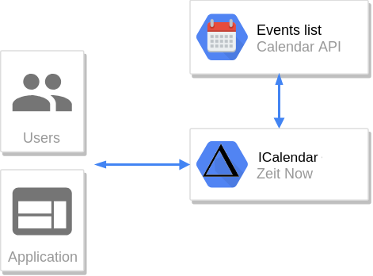

Some months ago the company where I work introduced a new policy called _bring your own device_ _(BYOD)_. Although, many already had set up the company's google mail on our phone for free, now we were encouraged to use our personal device to work, but in order to do so, we had to install a  [Google App Device Policy](https://support.google.com/a/users/answer/190930?hl=en). We were told that the objective of this policy was to protect sensible company's data and that this app will only enforce us to have a lock code and device encryption.

According to google's help:

> Depending on how your administrator manages Android devices in your organization, you might need to install the [Google Apps Device Policy app](https://play.google.com/store/apps/details?id=com.google.android.apps.enterprise.dmagent) on your device. The app enforces your organization’s security policies on your device to protect corporate data and make it more secure. If you don’t install the app, but your admin requires it, you can’t access G Suite data on your device, including work email, calendar, and contacts.

As far as the initial description is concerned, the app wasn't something I could complain of, but after reading what the admin could do with the app, it really got on my nerves:

> Some organizations require their users to install the Google Apps Device Policy app on their device. If you don't install the app, your mail, calendar and contacts may not sync with your device. Contact your G Suite admin for more details.
>
> Your admin can set the following security policies:
>
> * Device password strength and required length.
> * Number for the following items:
>   * **Invalid passwords allowed before the device is wiped.**
>   * Recently expired passwords that are blocked.
>   * Days before a device password expires.
>   * Idle minutes before a device automatically locks.
>   * **Days device has not synced before wiping**.
> * **Application auditing.**
> * **Remote wipe a device or an account from a device.**
> * Device policy app version requirements.
> * Blocking of security-compromised devices.
>
> Your admin can also configure Wi-Fi networks and manage network access certificates using the app. They might choose to hide a network's details so that only users who have the network name and password can connect to it.

What?, Why on Earth would I allow the company I work for to audit the application I use **on my personal device** and allow them to wipe it?.

## Unsynced way of working

When the policy was enforced, mail, calendar and files stopped syncing on my personal device. At first, I thought that well, I'd never used google drive on the device, I often ignored mails but I would really suffer from not having the calendar. I'm a bit forgetful, so being able to have notifications about meetings and being able to check my daily schedule while commuting really helped me.

My first try what just sharing my calendar to my personal account, this worked, but after some days, it stopped syncing. Sharing non public events was also forbidden to accounts that aren't from the organization. Then, I remember that Google allows to export calendars using a [Private Address](https://support.google.com/calendar/answer/37648?hl=en), but, as I couldn't find it, I concluded that it wasn't allowed.

It makes sense enforcing protection over drive and email, but, I really couldn't understand why I wasn't allowed to have a read-only version of my work calendar on my phone, particularly when I'm allow to have slack.

## Developers, developers, developers

Well, I'm a developer, I know that [google has a calendar api](https://developers.google.com/calendar/v3/reference/events/list), what else do I need to sync the calendar to my phone?.

Apparently, there is a [calendar format](https://en.wikipedia.org/wiki/ICalendar) which google supports syncing, so, my idea was generating a service which through an url exposes my calendar in that format and importing that url in my personal account calendar.

I didn't want to spend money on this project, and reduce time maintaining it, so my requirements were:

* The service should run on a free tier (nodejs server, static hosting)
* It should be serverless (aka, functions / lambda)
* The service shouldn't store any data (The less infrastructure it requires the less maintaining effort from my side).

I wanted to use this as an excuse of trying some serverless approach, I've played with Zeit's Now v1, but never had a chance of doing something with their [v2](https://zeit.co/blog/now-2). It has a [node builder](https://zeit.co/docs/v2/deployments/official-builders/node-js-now-node) and a [next js](https://zeit.co/docs/v2/deployments/official-builders/next-js-now-next) which fulfilled my needs backend and frontend needs.

Starting is as easy as forking their [monorepo example](https://zeit.co/examples). As regards the nodejs endpoints, things got a little more trickier. I really liked [Zeit's Micro approach](https://github.com/zeit/micro), and although it's from the same company they don't have a builder yet. There is a [community builder](https://github.com/lucasconstantino/now-micro) but it really didn't work for me. So, I ended up building a package called [micronize](https://www.npmjs.com/package/micronize) which enhances a regular labmda function with micro powers.

The project was very straight forward to be developed. Google token is stored on the url (something like Google calendar's Secret Address). So, when the calendar's endpoint gets hit, it reads google token and the calendar's id from the url, calls [events list api](https://developers.google.com/calendar/v3/reference/events/list), generates the icalendar file and serves it in the response. I heavily relied on the [ical-generator package](https://www.npmjs.com/package/ical-generator) to generate the ical output, which really made things easier.

The source code can be [GitHub](https://github.com/NickCis/google-icalendar-sync) and a working copy on [https://gics.now.sh](https://gics.now.sh "https://gics.now.sh").

***

Although, I had fun developing this project, I really don't get why sometimes organizations get in the way with bureaucracy. I understand that security concerns regarding sensible data stored on google products is important, but I don't think the way to achieve it is forbidding people to sync work's account in their personal phone, specially when they had been willing to do it for free. In most cases it will just decrease productivity, with no security increasement. I must highlight that I'm allowed (and also encouraged) to have Slack on the phone which probably has more sensible data than work's calendar.