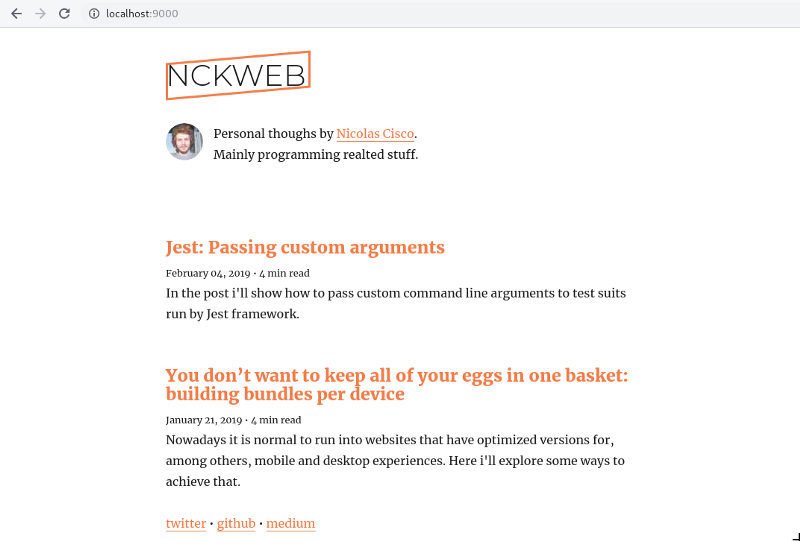
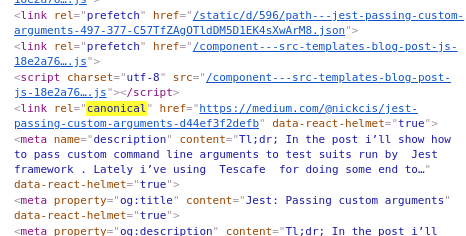
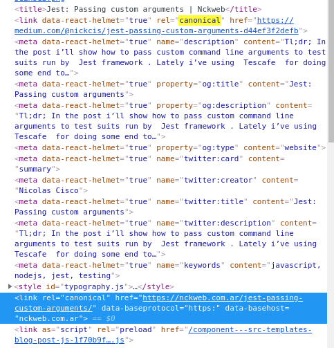

_tl;dr Developing a [`gatsby-plugin-react-helmet-canonical-urls`](https://github.com/NickCis/gatsby-plugin-react-helmet-canonical-urls) because `gatsby-plugin-canonical-urls` and `gatsby-plugin-react-helmet` do not play well together when using the canonical link._



Recently [Dan Abramov announced that he would stop writing in medium](https://medium.com/@dan_abramov/why-my-new-blog-isnt-on-medium-3b280282fbae), so, trying to set up my own [gatsby blog](https://www.gatsbyjs.org/) was a great week-end project. I really didn't want something fancy, just a blog site with a clean look that didn't take me so many time to set up.

My first step was opening [gatsby tutorial](https://www.gatsbyjs.org/tutorial/). Although, I must admit that the people from gatsby did a great work writing the docs, it seems to be targeted to new comers, i just didn't want to read how to install node and all that stuff. I wanted to throw a one liner in the terminal and figure out thins on the way.

I finally found the [generator cli](https://www.gatsbyjs.org/tutorial/part-zero/#create-a-gatsby-site) and borrowing some ideas from [Dan's Overreacted](https://github.com/gaearon/overreacted.io), I picked [gatsby's starter blog](https://github.com/gatsbyjs/gatsby-starter-blog) which, to be fair, met all my needs.

```
> npx gatsby new nckweb.com.ar https://github.com/gatsbyjs/gatsby-starter-blog
```

Mission accomplish 🚀.

I need to fix two SEO related issues and I was going to be ready to go:
- I planned to import my medium stories, I've to figure out how to set the canonical tag in order not to be penalized by Google because of duplicate content.
- I publish my site with `www` and without it, so I've to automatically set the canonical tag for all the page (e.g: `www.nckweb.com.ar/foo` page should have a canonical tag with the value: `nckweb.com.ar/foo` ).

## Custom Canonical data

The boilerplate file structure seemed a bit straight forward:

```
.
├── content
│   ├── assets
│   │   ├── icon.png
│   │   └── profile-pic.jpg
│   └── blog
│       └── first-post
│           └── index.md
├── gatsby-browser.js
├── gatsby-config.js
├── gatsby-node.js
├── package.json
├── README.md
├── src
│   ├── components
│   │   ├── bio.js
│   │   ├── layout.js
│   │   └── seo.js
│   ├── pages
│   │   ├── 404.js
│   │   └── index.js
│   ├── templates
│   │   └── blog-post.js
│   └── utils
│       ├── global.css
│       └── typography.js
├── static
│   ├── favicon.ico
│   └── robots.txt
└── yarn.lock
```

Checking the markdown of an example post, you figure out that properties are written with a front matter syntax ([just like jekyll's](https://jekyllrb.com/docs/front-matter/)). I just added a new one called `canonical_url` which will have the canonical value. (As [dev.to uses that name to set the canonical](https://clips.twitch.tv/RelievedSavageOctopusDoggo), I was in the hope 🤞 that it will automagically work, but i wasn't my lucky day).

I wanted to do some seo stuff, my first bet was checking the component with that name. Luckily, [that component](https://github.com/gatsbyjs/gatsby-starter-blog/blob/master/src/components/seo.js) was using [React Helmet](https://github.com/nfl/react-helmet). So, I just needed to figure out how to pass the front-matter `canonical_url` value to this seo component.

The next lead was the [`blog-post` component](https://github.com/gatsbyjs/gatsby-starter-blog/blob/master/src/templates/blog-post.js):


```jsx
class BlogPostTemplate extends React.Component {
  render() {
    const post = this.props.data.markdownRemark
    const siteTitle = this.props.data.site.siteMetadata.title
    const { previous, next } = this.props.pageContext

    return (
      <Layout location={this.props.location} title={siteTitle}>
        <SEO title={post.frontmatter.title} description={post.excerpt} />
        ...
      </Layout>
    )
  }
}

export const pageQuery = graphql`
  query BlogPostBySlug($slug: String!) {
    site {
      siteMetadata {
        title
        author
      }
    }
    markdownRemark(fields: { slug: { eq: $slug } }) {
      id
      excerpt(pruneLength: 160)
      html
      frontmatter {
        title
        date(formatString: "MMMM DD, YYYY")
      }
    }
  }
`;
```

Yay! 🎉. It was using the seo component and judging from the graphql query, getting the `canonical_url` was just adding the property to the `frontmatter` query.



So far, so good, I got the canonical for the imported posts.

## Plugins, plugins, plugins


I didn't want to reinvent the wheel, so my first attempt was [looking for a plugin](https://www.gatsbyjs.org/plugins/?=canonical) and I came across [`gatsby-plugin-canonical-urls`](https://www.npmjs.com/package/gatsby-plugin-canonical-urls) which did exactly what I needed.

Setting it up was as easy as reading its docs. But, things got a little bit ugly:



Two canonical links, why?

## Getting hands dirty

I was decided to fix this issue, so I jumped directly into code.

As far as i understand (checking [`gatsby-plugin-canonical-urls`](https://github.com/gatsbyjs/gatsby/tree/master/packages/gatsby-plugin-canonical-urls) and [`gatsby-plugin-react-helmet`](https://github.com/gatsbyjs/gatsby/tree/master/packages/gatsby-plugin-react-helmet) ) a plugin consist of the following structure:

```
.
├── index.js
├── package.json
├── .babelrc
├── README.md
├── src
│   ├── gatsby-browser.js
│   └── gatsby-ssr.js
└── yarn.lock
```

The relevant files are `gatsby-browser.js` and `gatsby-ssr.js`, `index.js` is just a stub. Those two first files allows the use of the [browser api](https://www.gatsbyjs.org/docs/browser-apis/) and the [ssr api](https://www.gatsbyjs.org/docs/ssr-apis/) respectively.

Reading the code:

```jsx
// gatsby-plugin-canonical-urls/src/gatsby-ssr.js

import React from "react"
import url from "url"

exports.onRenderBody = (
  { setHeadComponents, pathname = `/` },
  pluginOptions
) => {
  if (pluginOptions && pluginOptions.siteUrl) {
    const parsedUrl = url.parse(pluginOptions.siteUrl)
    const myUrl = `${pluginOptions.siteUrl}${pathname}`
    setHeadComponents([
      <link
        rel="canonical"
        key={myUrl}
        href={myUrl}
        data-baseprotocol={parsedUrl.protocol}
        data-basehost={parsedUrl.host}
      />,
    ])
  }
}

// gatsby-plugin-react-helmet/src/gatsby-ssr.js

import { Helmet } from "react-helmet"

exports.onRenderBody = ({
  setHeadComponents,
  setHtmlAttributes,
  setBodyAttributes,
}) => {
  const helmet = Helmet.renderStatic()
  // These action functions were added partway through the Gatsby 1.x cycle.
  if (setHtmlAttributes) {
    setHtmlAttributes(helmet.htmlAttributes.toComponent())
  }
  if (setBodyAttributes) {
    setBodyAttributes(helmet.bodyAttributes.toComponent())
  }
  setHeadComponents([
    helmet.title.toComponent(),
    helmet.link.toComponent(),
    helmet.meta.toComponent(),
    helmet.noscript.toComponent(),
    helmet.script.toComponent(),
    helmet.style.toComponent(),
  ])
}
```

Both plugins implement the `onRenderBodyapi`:

> Called after every page Gatsby server renders while building HTML so you can set head and body components to be rendered in your `html.js`.
>
> Gatsby does a two-pass render for HTML. It loops through your pages first rendering only the body and then takes the result body HTML string and passes it as the `body` prop to your `html.js` to complete the render.
>
> It's often handy to be able to send custom components to your html.js. For example, it's a very common pattern for React.js libraries that support server rendering to pull out data generated during the render to add to your HTML.

At this point, I got a clear picture of what was happening:

- Both plugins added elements on the head calling `setHeadComponents`
- Gatsby didn't prevent from `link rel="canonical"` repetition
- Both plugins didn't take care if other plugin added the canonical tag.

## Possible solutions

As I didn't want to reinvent the wheel, my first attempt was to _"fix"_ any of the mentioned issues.

1. Making Gatsby's `setHeadComponents` aware that `link rel="canonical"` have not to be repeated.

Although this was one of my firsts thoughts, I wasn't really convinced by it. First of all depended on the plugins execution order (ie.: the first call `setHeadComponents` will be the one which win). And in order to develop this, I needed a better understanding of how Gatsby worked.

2. Implement the [`onPreRenderHTML`](https://www.gatsbyjs.org/docs/ssr-apis/#onPreRenderHTML) api on any of the plugins (or create a new plugin that implement this api) in order to remove the duplicated `link rel="canonical"`.

In order to avoid the repetition I needed to use `getHeadComponent` to get all head components, check if there is a duplicated canonical and then use `replaceHeadComponents` to set the head components deduplicated. Doing this will also depend on the plugin's execution order which was something I wanted to avoid. In addition, the documentation has a uppercased warning (_"WARNING if multiple plugins implement this API it’s the last plugin that 'wins'"_) which discouraged me from this approach.

3. React Helmet deals with this kind of duplication, if the canonical's plugin instead of using `setHeadComponents` set the link with react-helmet's api, the problem will be solved.

As I was using react-helmet in order to set meta tags, this solution actually made sense. I had just to figure out how to add the `Helmet` component.

## Canonicals with Helmet

With this approach I'll have to add the `Helmet` element. As it has to be done before the `onRenderBody` is called, i shouldn't use that api. In addition, in order to give the lower priority to the default canonical tag, this component has to be placed first (ie, on a higher level in the react's component tree) than the `Helmet` component that the page uses.

A simple way to achieve those things is wrapping current page and inserting a _Helmet_ component in that wrap:

```jsx
const Wrapper = ({ children, ...props }) => (
  <>
    <Helmet>
      link={[
        rel: 'canonical'
        ...
      ]}
    />
    { children }
  </>
);
```

Gatsby has the [`wrapPageElement`](https://www.gatsbyjs.org/docs/ssr-apis/#wrapPageElement) which allows to exactly do that:

```jsx
const React = require('react');
const { Helmet } = require('react-helmet');

exports.wrapPageElement = ({ element, props }, pluginOptions) => {
  if (pluginOptions && pluginOptions.siteUrl) {
    const myUrl = `${pluginOptions.siteUrl}${props.location.pathname || '/'}${props.location.search}${props.location.hash}`;

    return (
      <>
        <Helmet
          link={[
            {
              rel: 'canonical',
              key: myUrl,
              href: myUrl,
            }
          ]}
        />
        {element}
      </>
    );
  }

  return element;
};
```

## What about client side rendering?

In order to be consistent, the plugin should also add the `Helmet` component on the client side. Although, if I don't add it, I won't trigger any React hydratation issue (the DOM tree that react hydratates is the same with or without this default canonical Helmet compoent), the canonical link is being removed when the client side react runs.

In addition, if you check `gatsby-plugin-canonical-urls`, you'll notice that it also implement [`gatsby-browser`](https://github.com/gatsbyjs/gatsby/blob/master/packages/gatsby-plugin-canonical-urls/src/gatsby-browser.js):

```js

exports.onRouteUpdate = ({ location }) => {
  const domElem = document.querySelector(`link[rel='canonical']`)
  var existingValue = domElem.getAttribute(`href`)
  var baseProtocol = domElem.getAttribute(`data-baseProtocol`)
  var baseHost = domElem.getAttribute(`data-baseHost`)
  if (existingValue && baseProtocol && baseHost) {
    domElem.setAttribute(
      `href`,
      `${baseProtocol}//${baseHost}${location.pathname}${location.search}${
        location.hash
      }`
    )
  }
}
```

Luckily, gatsby's browser APi implements the [`wrapPageElement` method](https://www.gatsbyjs.org/docs/browser-apis/#wrapPageElement). So fxing this client side issues is just exposing the same method under the browser's api.

---

So far the experience implementing a Gatbsy blog has been great!. The API is very simple, so if the long list of plugins doesn't suit you, you can easily implement yours.

Comunity arround the project is very active, I even got a gift swag for fixing a [little doc issue](https://github.com/gatsbyjs/gatsby/pull/11844) while doing this post!


