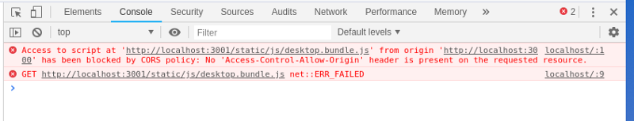

This is a round up of the first talk I did called [_“No metas todo en la misma bolsa: generando bundles por dispositivo”_](https://www.meetup.com/es/React-js-en-Buenos-Aires/events/252948807/) (which could be translated to the title of this article).

[](https://drive.google.com/file/d/1vnsMVslNssKV3W3Mv_i2ZwCa5Gh9GZp3/view)

**This is the second post in a series** where I explain how to encapsulate the specific device logic into a Razzle plugin:

* [Building bundles per device](https://medium.com/@nickcis/you-dont-want-to-keep-all-of-your-eggs-in-one-basket-building-bundles-per-device-887e21772453)
* _Avoiding boilerplate: Developing a razzle plugin (this post)_
* _Generalizing: Developing a webpack plugin (wip)_

***

_tl;dr; the idea is to reduce the needed boilerplate in order to serve particular experiences for each device._

This post will be more code related, I’ll show how I encapsulated the specific device logic into a razzle plugin and all the problems I’ve had to sort that out. In the end, there will be a working example of this feature.


## Razzle

Well, first of all, what is [Razzle](https://github.com/jaredpalmer/razzle)?:

> Universal JavaScript applications are tough to setup. Either you buy into a framework like [Next.js](https://github.com/zeit/next.js) or [react-server](https://github.com/redfin/react-server), fork a boilerplate, or set things up yourself. Aiming to fill this void, Razzle is a tool that abstracts all complex configuration needed for SSR into a single dependency — giving you the awesome developer experience of [create-react-app](https://github.com/facebookincubator/create-react-app), but then leaving the rest of your app’s architectural decisions about frameworks, routing, and data fetching up to you. With this approach, Razzle not only works with React, but also Reason, Elm, Vue, Angular, and most importantly……whatever comes next.

In shorts, it’s a tool that let’s you concentrate on developing the app instead of setting up all the SSR configuration. I’ve been using it since the 0.8 version and I really liked. Version 2.0 introduced plugins in order to modify webpack set up. And this last feature is what will be used.

## Plugins

[Razzle plugins](https://github.com/jaredpalmer/razzle#writing-plugins) are functions that are called [after razzle creates the webpack config object](https://github.com/jaredpalmer/razzle/blob/master/packages/razzle/config/createConfig.js#L605).

```js
'use strict';

module.exports = function myRazzlePlugin(config, env, webpack, options) {
  const { target, dev } = env;

  if (target === 'web') {
    // client only
  }

  if (target === 'server') {
    // server only
  }

  if (dev) {
    // dev only
  } else {
    // prod only
  }

  // Do some stuff...
  return webpackConfig;
};
```

This function is called for each configuration (web and node) and allows you to modify and return a new configuration object.

Keep in mind that what returns the last plugin will be [thrown to webpack](https://github.com/jaredpalmer/razzle/blob/master/packages/razzle/scripts/build.js#L90). We will abuse of this, webpack’s config object will be replaced with an array in order to use the _multicompiler_ feature.

## DeviceModuleReplacementPlugin

The magic behind the device module implementation is resolving to a device specific file, instead of the required one. As it was explained in the first post, the idea is that if a file with the device extension ( `<filename>.<device>.js`) exists, it will be used instead of the regular file ( `<filename>.js`).

On the first post, [webpack’s NormalModuleReplacement](https://webpack.js.org/plugins/normal-module-replacement-plugin/) plugin was used, in order to clean things up, a new webpack plugin was developed.

I won’t enter into details of how webpack internally work as this was mostly inspired [by NormalModuleReplacement code](//%20https://github.com/webpack/webpack/blob/master/lib/NormalModuleReplacementPlugin.js):

```js
class NormalModuleReplacementPlugin {
    // ...
  
	apply(compiler) {
		const resourceRegExp = this.resourceRegExp;
		const newResource = this.newResource;
		compiler.hooks.normalModuleFactory.tap(
			"NormalModuleReplacementPlugin",
			nmf => {
				nmf.hooks.beforeResolve.tap("NormalModuleReplacementPlugin", result => {
					if (!result) return;
					if (resourceRegExp.test(result.request)) {
						if (typeof newResource === "function") {
							newResource(result);
						} else {
							result.request = newResource;
						}
					}
					return result;
				});
				nmf.hooks.afterResolve.tap("NormalModuleReplacementPlugin", result => {
					if (!result) return;
					if (resourceRegExp.test(result.resource)) {
						if (typeof newResource === "function") {
							newResource(result);
						} else {
							result.resource = path.resolve(
								path.dirname(result.resource),
								newResource
							);
						}
					}
					return result;
				});
			}
		);
	}
}
```

To summarize things, imported files are called modules. Webpack has a normal module factory that is encharged of creating the entity that represents that module. Plugins can hook to certain events of this factory in order to change custom behavior.

The idea is to hook up to the `beforeResolve` and `afterResolve` events in order to modify the requested module, just as _normal module replacement plugin_ does. But, as this is a custom plugin, it has access to webpack’s internal resolver which will be used to check if the device specific file (_aka module)_ exists.

```js
class DeviceModuleReplacementPlugin {
  resolveByDevice(nmf, result, callback = () => {}) {
    const resolver = nmf.getResolver('normal', result.resolveOptions);
    const request = result.request.split('!');
    const { root, dir, name, ext } = path.parse(request.pop());
    const contextInfo = result.contextInfo || result.resourceResolveData.context;
    const device = contextInfo.compiler.split('.')[0];
    const file = path.format({
      root,
      dir,
      name,
      ext: `.${device}${ext}`
    });

    resolver.resolve(contextInfo, result.context, file, {}, err => {
      if (!err) {
        request.push(file);
        result.request = request.join('!');
      }

      callback();
    });
  }

  apply(compiler) {
    compiler.hooks.normalModuleFactory.tap(
      'DeviceModuleReplacementPlugin',
      nmf => {
        nmf.hooks.beforeResolve.tapAsync('DeviceModuleReplacementPlugin', (result, callback) => {
          if (!result) return callback();
          if (!result.context.startsWith(this.folder)) return callback();
          this.resolveByDevice(nmf, result, callback);
        });

        nmf.hooks.afterResolve.tapAsync('DeviceModuleReplacementPlugin', (result, callback) => {
          if (!result) return callback();
          if (!result.context.startsWith(this.folder)) return callback();
          this.resolveByDevice(nmf, result, callback);
        });
      }
    );
  }
}
```

As a side note, remember that Webpack allows to declare [loaders using an inline syntax](https://webpack.js.org/concepts/loaders/#inline). This means that a _resource_ might be something like this:

```js
import Styles from 'style-loader!css-loader?modules!./styles.css';
```

Data is piped using an exclamation mark ( `!`) and the file is always at last.

Another note, the device name can be got from the compilers name (`contextInfo.compiler.split('.')[0]`), as a convention, the compiler name will be set to `${device}.${target}` (_target_ is web or node).

## Web bundle

As far as configuration for web bundle is concerned, only two things have to be done:

1. Generate one bundle per device
2. Replace modules with device specific ones

To achieve the first objective, it is going to be abused the fact that the modified configuration is passed directly to webpack. The returned object will be replaced by an array. Each item of the array is going to be the configuration for each device.

As regards the second, _DeviceModuleReplacementPlugin_ will do the trick. This plugin will be added to the original config.

```js
function web(config, { devices }, webpack) {
  const clients = devices.map(device => ({
    ...config,
    name: `${device}.client`,
    entry: {
      [`${device}.client`]: config.entry.client,
    },
    output: {
      ...config.output,
      filename: config.output.filename.replace('bundle', `${device}.bundle`),
      chunkFilename: config.output.chunkFilename.replace('[name]', `${device}.[name]`),
    },
    plugins: [
      ...config.plugins,
      new webpack.DefinePlugin({
        'process.device': JSON.stringify(device),
      }),
      new DeviceModuleReplacementPlugin(path.resolve('./src')),
    ],
  }));

  return clients;
}
```

After some tests, I’ve realized that dev server stopped working as expected. I got some _CORS_ errors on the browser’s console and the bundle failed to load:



To understand a bit what was happening, I had to pay special attention to the [_How razzle works (the secret sauce)_](https://github.com/jaredpalmer/razzle#how-razzle-works-the-secret-sauce) part of the readme:

> In development mode (`razzle start`), Razzle bundles both your client and server code using two different webpack instances running with Hot Module Replacement in parallel. While your server is bundled and run on whatever port you specify in `src/index.js` (`3000` is the default), the client bundle (i.e. entry point at `src/client.js`) is served via `webpack-dev-server` on a different port (`3001` by default) with its `publicPath` explicitly set to `localhost:3001` (and not `/` like many other setups do). Then the server's html template just points to the absolute url of the client JS: `localhost:3001/static/js/client.js`. Since both webpack instances watch the same files, whenever you make edits, they hot reload at _exactly_ the same time. Best of all, because they use the same code, the same webpack loaders, and the same babel transformations, you never run into a React checksum mismatch error.

My best bet is that I was somehow overriding dev server configuration. Checking [razzle’s start script](https://github.com/jaredpalmer/razzle/blob/master/packages/razzle/scripts/start.js#L72), I came across that the `devServer` property of webpack’s configuration was being used:

```js
  // Create a new instance of Webpack-dev-server for our client assets.
  // This will actually run on a different port than the users app.
  const clientDevServer = new devServer(clientCompiler, clientConfig.devServer);

  // Start Webpack-dev-server
  clientDevServer.listen(
    (process.env.PORT && parseInt(process.env.PORT) + 1) || razzle.port || 3001,
    err => {
      if (err) {
        logger.error(err);
      }
    }
  );
```

Just setting that property to the returned array fixed the problem:

```js
function web(config, { devices }, webpack) {
  const clients = devices.map(device => ({
    ...config,
    name: `${device}.client`,
    entry: {
      [`${device}.client`]: config.entry.client,
    },
    output: {
      ...config.output,
      filename: config.output.filename.replace('bundle', `${device}.bundle`),
      chunkFilename: config.output.chunkFilename.replace('[name]', `${device}.[name]`),
    },
    plugins: [
      ...config.plugins,
      new webpack.DefinePlugin({
        'process.device': JSON.stringify(device),
      }),
      new DeviceModuleReplacementPlugin(path.resolve('./src')),
    ],
  }));

  clients.devServer = config.devServer;

  return clients;
}
```

## Node bundle (or must i say bundles?)

The node part is a bit trickier. Generating a bundle per device won't work, as it is needed an extra one that does the server's listening and device detection (to execute the device specific rendering and bundle serving).

### Production build

We will start with production build, since it's simpler (I'll explain later why).

Tasks to be done:

* Generate server bundle
* Generate bundles per device
* Develop a way to import the device specific bundles in the main server one

Well, the first task is the easiest one. No work has to be done, as it's the default bundle that razzle generates. So, our `node` function will start being something like this:

```js
function node(config) {
  return config;
}
```

For the second objective, we can't just add the _DeviceModuleReplacementPlugin,_ as this will generate a duplication of common server stuff (server listening, device detection, etc). In order to perform device separation, all the code that could be different per device will live on another [entry point](https://webpack.js.org/concepts/entry-points/).

    src
    ├── index.js
    ├── client
    │   └── ...
    └── ssr.js

The code that's in the main server's entry point (ie: `src/index.js`) won't be changed per device:

```js
import http from 'http';
import express from 'express';

const server = http.createServer(
  express()
    .disable('x-powered-by')
    .use(express.static(process.env.RAZZLE_PUBLIC_DIR))
    .get('/*', (req, res) => {
      res.status(200).send('To be rendered');
    })
);
    
server.listen(process.env.PORT || 3000);
```

While the server side rendering entry point (ie: `src/ssr.js`) will:

```js
import App from './client/App';
import React from 'react';
import { StaticRouter } from 'react-router-dom';
import { renderToString } from 'react-dom/server';

const manifest = require(process.env.RAZZLE_ASSETS_MANIFEST);
const assets = Object.entries(manifest)
  .reduce(
    (assets, [key, value]) => {
      const [device, k] = key.split('.');
      if (device === process.device)
        assets[k] = value;
      return assets;
    },
    {}
  );

const render = (req, res) => {
  const context = {};
  const markup = renderToString(
    <StaticRouter context={context} location={req.url}>
      <App />
    </StaticRouter>
  );

  if (context.url) {
    res.redirect(context.url);
  } else {
    res.status(200).send(
      `<!doctype html>
  <html lang="">
  <head>
      <meta httpEquiv="X-UA-Compatible" content="IE=edge" />
      <meta charSet='utf-8' />
      <title>Welcome to Razzle: ${process.device}</title>
      <meta name="viewport" content="width=device-width, initial-scale=1">
      ${assets.client.css
        ? `<link rel="stylesheet" href="${assets.client.css}">`
        : ''}
      ${process.env.NODE_ENV === 'production'
        ? `<script src="${assets.client.js}" defer></script>`
        : `<script src="${assets.client.js}" defer crossorigin></script>`}
  </head>
  <body>
      <div id="root">${markup}</div>
  </body>
  </html>`
    );
  }
};

export default render;
```

As far as device select, the same approach of the web bundles will be used, _DeviceModuleReplacementPlugin_:

```js
function node(config, { devices, entry }) {
  const bundles = devices.map(device => {
    const filename = `${device}.server.js`;
    return {
      filename,
      device,
      name: `${device}.server`,
      path: path.join(config.output.path, filename),
    }
  });
  
  return [
    config,
    bundles.map(({ device, name, filename }) => ({
      ...config,
      entry,
      output: {
        ...config.output,
        filename,
      },
      plugins: [
      	...config.plugins,
        new webpack.DefinePlugin({
          'process.device': JSON.stringify(device),
        }),
        new DeviceModuleReplacementPlugin(path.resolve('./src')),
      ]
    })),
  ];
}
```

**Note:** In order to use `process.device`  to get the device, I've [webpack's DefinePlugin](https://webpack.js.org/plugins/define-plugin/) to set that variable.

At last, but not least, it's needed a way to import the deviced modules into the main server file. Keep in mind that as we are using the multicompiler feature, deviced server modules are being created in parallel with the main server module, so, just trying to import it will fail  (webpack will complain about not finding the required file).

As there is no need of compiling all the server into one file, we could just tell webpack to differ importing those deviced modules to runtime. The easiest way to achieve it is just setting them as [`externals`](https://webpack.js.org/configuration/externals/).

```js
function node(config, { devices, entry }) {
  const bundles = devices.map(device => {
    const filename = `${device}.server.js`;
    return {
      filename,
      device,
      name: `${device}.server`,
      path: path.join(config.output.path, filename),
    }
  });
  
  return [
    {
      ...config,
      externals: [
        ...config.externals,
        bundles.map(({ filename }) => filename),
      ],
      plugins: [
        ...config.plugins,
        new webpack.DefinePlugin({
          'process.devices': JSON.stringify(devices),
        }),
      ],
    },
    bundles.map(({ device, name, filename }) => ({
      ...config,
      entry,
      output: {
        ...config.output,
        filename,
      },
      plugins: [
      	...config.plugins,
        new webpack.DefinePlugin({
          'process.device': JSON.stringify(device),
        }),
        new DeviceModuleReplacementPlugin(path.resolve('./src')),
      ]
    })),
  ];
}
```

**Note:** In order to use `process.devices`  to get the device, I've [webpack's DefinePlugin](https://webpack.js.org/plugins/define-plugin/) to set that variable.

As far as the main server is concerned:

```js
import http from 'http';
import express from 'express';
import mobile from './mobile.server';
import desktop from './desktop.server';

const server = http.createServer(
  express()
    .disable('x-powered-by')
    .use(express.static(process.env.RAZZLE_PUBLIC_DIR))
    .get('/*', (req, res) => {
      if ( /* decide if it's mobile */ ) {
      	mobile(req, res);
        return;
      }
         
      desktop(req, res);
    })
);
    
server.listen(process.env.PORT || 3000);
```

**Note:** Razzle comes with a [`react-dev-utils`](http://npmjs.com/package/react-dev-utils) version that doesn't support webpack's multicompiler output, a newer version must be loaded using the [selective version resolutions](https://yarnpkg.com/lang/en/docs/selective-version-resolutions/).

### Dev

On development, things got a little bit harder as razzle has _hot module replacement_. Particularly, this brings several problems:

* Hot reloading plugins have to be removed from the deviced modules
* [Start Server plugin](https://github.com/ericclemmons/start-server-webpack-plugin) isn't prepared for a multicompiler environment
* `externals` approach for importing deviced modules will not hot reload

The first issue is pretty straight forward to be solved, filtering instances of `webpack.HotModuleReplacementPlugin` will do the trick:

    plugins.filter(plugin => !(plugin instanceof webpack.HotModuleReplacementPlugin))

Regarding Start server plugin, it wasn't develop to deal with a multicompiler environment, ie, it starts the server when the [_afterEmit_](https://webpack.js.org/api/compiler-hooks/#afteremit) event of the compiler is dispatched. The problem in the multicompiler environment is that we don't have just one compiler, so we'll have an _afterEmit_ event per device (and one extra for the main server). The server will be started when the first event is dispatched, but we want to start it when the last event is fired. In order to address this issue, is sent a [PR](https://github.com/ericclemmons/start-server-webpack-plugin/pull/32), hoping that we could just do the [_selective version resolution_](https://yarnpkg.com/lang/en/docs/selective-version-resolutions/) trick.

Unluckily, I got no response from the plugin's maintainers. So, I ended up forking and publishing the plugin under a scope. From the razzle plugin side, we'll have to filter the _Start server plugin_ and add the new one:

```js
const StartServerPlugin = require('@nickcis/start-server-webpack-plugin');

// ...

function node(config, { dev /*, ... */ }, webpack) {
  // ...
  let plugins = config.plugins;
  
  if (dev) {
    const startServerOptions = config.plugins.find(
      p =>
        p
        && p.constructor
        && p.constructor.name === 'StartServerPlugin'
    ).options;

    plugins = [
      ...config.plugins.filter(
        p =>
          p
          && (
            !p.constructor
            || p.constructor.name !== 'StartServerPlugin'
          )
      ),
      new StartServerPlugin(startServerOptions)
    ];
    
    // ...
  }
  
  // ...
}
```

Last issue to be addressed is how to fix hot reloading for the deviced modules. The `externals` approach will only be used for the production build, for development, we'll just write a mock module which requires itself on runtime. In this way, webpack will bundle the `require` which will trigger importing on runtime. How can we trick webpack into writing an actual `require`?, easy, with a dirty `eval`:

```js
// desktop.server.js
const r = eval('require');
module.exports = r('./desktop.server');
```

For the time the server starts, the deviced module bundling will have been finished and the mocked file will have been replaced with the actual module _(which will trigger a rebuild and hot reloading)_. Although, this isn't ideal, it works _(and is only used for development)_.

Rounding up things:

```js
function node(config, { dev, devices, entry }, webpack) {
  const bundles = devices.map(device => {
    const filename = `${device}.server.js`;
    return {
      filename,
      device,
      name: `${device}.server`,
      path: path.join(config.output.path, filename),
    }
  });

  let plugins = config.plugins;

  if (dev) {
    const startServerOptions = config.plugins.find(
      p =>
        p
        && p.constructor
        && p.constructor.name === 'StartServerPlugin'
    ).options;

    plugins = [
      ...config.plugins.filter(
        p =>
          p
          && (
            !p.constructor
            || p.constructor.name !== 'StartServerPlugin'
          )
      ),
      new StartServerPlugin(startServerOptions)
    ];
    
    writeMockModules(bundles);
  }

  const serversPath = path.join(config.output.path, 'servers.js');

  return [
    ...bundles.map(({ device, name, filename }) => ({
      ...config,
      name,
      plugins: [
        ...plugins.filter(plugin => !(plugin instanceof webpack.HotModuleReplacementPlugin)),
        new webpack.DefinePlugin({
          'process.device': JSON.stringify(device),
        }),
        new DeviceModuleReplacementPlugin(path.resolve('./src')),
      ],
      entry,
      output: {
        ...config.output,
        filename,
      }
    })),
    {
      ...config,
      externals: [
        ...config.externals,
        ...(dev
          ? []
          : bundles.map(({ filename }) => `./${filename}`)
        ),
      ],
      plugins: [
        ...plugins,
        new webpack.DefinePlugin({
          'process.devices': JSON.stringify(devices)
        }),
        new ServersPlugin(serversPath, bundles, dev),
      ],
    },
  ];
}
```

**Note:** `writeMockModules` is supposed to write the mock initial require files for all the deviced modules, on the actual implementation a [webpack's plugin](https://github.com/NickCis/razzle-plugin-device-specific-bundles/blob/master/ServersPlugin.js) does this job.

***

The final implementation is called [`razzle-plugin-device-spcific-bundles`](https://www.npmjs.com/package/razzle-plugin-device-specific-bundles) it can be found on [github](https://github.com/NickCis/razzle-plugin-device-specific-bundles).

As far as installation and usage is concerned, the package has to be added:

    yarn add --dev razzle-plugin-device-specific-bundles

And then, the plugin should be specified on `razzle.config.js` , _it should be the last plugin_:

```js
// razzle.config.js

module.exports = {
  plugins: ['device-specific-bundles'],
};
```

Some options can be edited:

* `devices`: An array of the enabled devices, by default `[ 'desktop', 'mobile' ]`
* `entry`: The server's deviced entry point, by default `ssr.js`
* `alias`: The alias used in the server to include an object with all the deviced modules, by default `SSR`

We'll write the following server's main entry point:

```js
// src/index.js

import http from 'http';
import express from 'express';
import modules from 'SSR';

const server = http.createServer(
  express()
    .disable('x-powered-by')
    .use(express.static(process.env.RAZZLE_PUBLIC_DIR))
    .get('/*', (req, res) => {
      const device = process.devices[Math.floor(Math.random() * process.devices.length)];
      modules[device](req, res);
    })
);

server.listen(process.env.PORT || 3000);
```

**Note:** in order to fake device decision we'll just pick any device randomly, ideally, user agent sniffing or something of the sort should be done.

And have the following `src/ssr.js`:

```js
// src/ssr.js

import App from './App';
import React from 'react';
import { StaticRouter } from 'react-router-dom';
import { renderToString } from 'react-dom/server';

const manifest = require(process.env.RAZZLE_ASSETS_MANIFEST);
const assets = Object.entries(manifest)
  .reduce(
    (assets, [key, value]) => {
      const [device, k] = key.split('.');
      if (device === process.device)
        assets[k] = value;
      return assets;
    },
    {}
  );

const render = (req, res) => {
  const context = {};
  const markup = renderToString(
    <StaticRouter context={context} location={req.url}>
      <App />
    </StaticRouter>
  );

  if (context.url) {
    res.redirect(context.url);
  } else {
    res.status(200).send(
      `<!doctype html>
  <html lang="">
  <head>
      <meta httpEquiv="X-UA-Compatible" content="IE=edge" />
      <meta charSet='utf-8' />
      <title>Welcome to Razzle: ${process.device}</title>
      <meta name="viewport" content="width=device-width, initial-scale=1">
      ${assets.client.css
        ? `<link rel="stylesheet" href="${assets.client.css}">`
        : ''}
      ${process.env.NODE_ENV === 'production'
        ? `<script src="${assets.client.js}" defer></script>`
        : `<script src="${assets.client.js}" defer crossorigin></script>`}
  </head>
  <body>
      <div id="root">${markup}</div>
  </body>
  </html>`
    );
  }
};

export default render;
```

Remember that the `App` component has device implementations, what is to say, some child components will have different implementations for desktop and mobile:

    src
    ├── index.js
    ├── ssr.js
    ├── client.js
    ├── App.js
    ├── Component.desktop.js
    └── Component.mobile.js

So, when mobile's render is called, it will run the bundle with the `Component.mobile.js` and when the desktop's one is called, the bundle with `Component.desktop.js` will be used.

The full example can be found on [github](https://github.com/NickCis/razzle-plugin-device-specific-bundles/tree/master/example).

***

Although, most of the boilerplate was reduced, there are several things to improve.

On the next post of the series, we'll try to generalize the implementation writing a webpack plugin in order to remove the need to use razzle. So, the device feature could be implemented on any project that uses webpack!. In addition, working directly with webpack will give us the possibility of removing all those compilations, improving build times!.


_Yes, I've probably repeated webpack too much_.